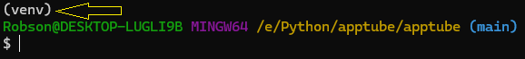

<h1> Projeto criado com o intuito de fazer um RPA com Python puro </h1>

<h3> 
    Ferramentas utilizadas:

    - Python
    - Selenium
    - Sistema Faker
</h3>

<h2>
Esse projeto é um RPAzinho feito utilizando python como a linguagem de programação e foi utilizado o selenium como biblioteca para manipular o navegador.
<br>
Primeiro ele abre o navegador com o selenium depois com o python tem a leitura de alguns arquivos nativamente, com isso ele abre uma base de dados em .txt totalmente bagunçada e com o python fazemos o tratamento e direcionamos cada informação para seu devido campo.
</h2>

<h4>
Para Iniciar você terá que ter o Python instalado em sua máquina
</h4>

<p>Pode baixar no site oficial clicando aqui =><a href= 'https://www.python.org/downloads/'>Site Oficial</a></p>

<h4>
Depois de Instalado você poderá fazer o clone do repositorio
</h4>

```
git clone git@github.com:RobsonWebDev/apptube.git
```
Utilizando o codigo
```
Windows: python -m venv venv

Linux: pytoon3 -m venv venv
```
Para ativar o ambiente virtual
```
Windows: source venv/Scripts/activate

Linux: source venv/bin/activate
```
"Lembrando que você tem que estar dentro do mesmo diretório do seu arquivo e criar seu ambiente virtual, ressaltando que no windows esse último comando não funciona pelo PowerShell."

Com o seu ambiente ativado você perceberá o nome dele acima do caminho do seu computador como na imagem abaixo:



Execute o seguinte comando:
```
pip install -r requirements.txt
```

Nesse arquivo estão todas as bibliotecas que utilizamos, apesar de serapenas o selenium porem ao instalar a própria biblioteca é responsável por instalar demais dependecias que poderá ser utilizada.

A biblioteca que utilizamos foi:

```
Selenium
```

O Sistema Faker não precisa ser instalado fei feito com HTML, CSS e JS puro. Isso significa que basta abrir o 'index.html' na pasta escolher o seu navegador padrão para abri-lo, que o seu navegador ficará responsável pelo resto.
<br>
Copie o caminho que aparece na url do seu navegador e cole no projeto.
```
navegador.get('C:/COLE SEU CAMINHO AQUI')
```
<h3>
Com tudo Instalado
</h3>

É hora de rodar o projeto:

```
Windows: python main.py

Linux: python3 main.py
```

<h3>Aplicação Funcionando:
<br>
<br>

